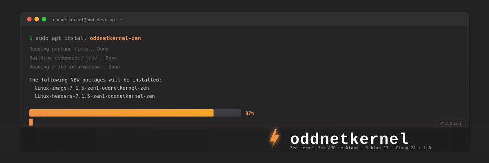

<picture>
  <source media="(prefers-color-scheme: dark)" srcset="assets/banner.svg">
  
</picture>

# oddnetkernel

Custom Linux kernel for my AMD desktop. Ryzen 5 2600 (Zen+), Radeon RX 570 (Polaris), Debian 13.

Built from mainline 7.1.5 with the Zen kernel patchset, compiled with Clang 21 + LLD. I run this daily — it's tuned for what I use, not for everyone.

---

## Install

Debian 13 (Trixie), amd64 only:

```bash
curl -s 'https://raw.githubusercontent.com/cpntodd/oddnetkernel/master/install-oddnetkernel.sh' | sudo bash
```

Or step by step:

```bash
# Add the apt repo
sudo mkdir -p /etc/apt/keyrings
curl -fsSL https://cpntodd.github.io/oddnetkernel/oddnetkernel-archive-keyring.gpg | \
    sudo gpg --dearmor -o /etc/apt/keyrings/oddnetkernel-archive-keyring.gpg
echo 'deb [arch=amd64 signed-by=/etc/apt/keyrings/oddnetkernel-archive-keyring.gpg] https://cpntodd.github.io/oddnetkernel/repo stable main' | \
    sudo tee /etc/apt/sources.list.d/oddnetkernel.list
sudo apt update
sudo apt install 'linux-image-*-oddnetkernel-zen' 'linux-headers-*-oddnetkernel-zen'
sudo reboot
```

---

## What's Changed from Debian's Stock Kernel

### Zen patchset

The [Zen kernel](https://github.com/zen-kernel/zen-kernel) applies patches that adjust scheduling, memory reclaim, and I/O decisions toward lower latency. The most noticeable effect on a desktop is that interactive tasks (browser, terminal, editor) get CPU time sooner under mixed load.

Specific tunables the Zen patchset exposes or changes:

- `CONFIG_HZ=1000` — faster timer tick than Debian's default 250 Hz
- Preemption model set to `PREEMPT_DYNAMIC` with lazy preemption
- Kyber I/O scheduler available alongside mq-deadline
- BBRv2 TCP congestion control available (though I use CUBIC)
- Various memory management watermark and reclaim aggressiveness changes from upstream Zen

### Clang toolchain

I build with Clang 21 instead of GCC. No ideological reason — I wanted to see if the LLVM build worked on 7.x, and it does. The kernel builds and boots fine. `bindeb-pkg` with `LLVM=1` Just Works.

### Hardware config

Enabled everything my desktop actually has:

- **CPU:** `CONFIG_MZEN` (Family 17h / Zen+), with `AMD_PSTATE` and `X86_AMD_FREQ_SENSITIVITY`
- **GPU:** Full `amdgpu` driver including Southern Islands and Sea Islands (older GCN cards), Display Core for HDMI/DP audio
- **NIC:** Realtek r8169 built-in (not as a module — avoids initramfs ordering issues I've hit on this board)
- **Storage:** NVMe built-in, SATA AHCI
- **Filesystems in use:** Btrfs, XFS, NTFS3, exFAT, CIFS/SMB, OverlayFS, NFS
- **Networking:** WireGuard, bridge, VXLAN
- **Virtualization:** KVM + VIRTIO

What I left OUT: WiFi drivers I don't use, Bluetooth, InfiniBand, most enterprise RAID cards, sound drivers beyond HDMI/DP audio, and every filesystem I've never touched.

---

## Kernel Config Summary

| Setting | Value |
|---|---|
| CPU Scheduler | EEVDF |
| Preemption | `PREEMPT_DYNAMIC` (lazy) |
| Timer Frequency | 1000 Hz |
| I/O Scheduler | mq-deadline |
| TCP Congestion | CUBIC |

---

## Current Build

| | |
|---|---|
| Version | `7.1.5-zen1-oddnetkernel-zen` |
| Base | Linux 7.1.5 |
| Patches | Zen kernel v7.1.5-zen1 |
| Compiler | Clang 21.1.8 (LLVM 21) |
| Linker | LLD 21.1.8 |
| Hardware target | Ryzen 5 2600, RX 570/580, RTL8111, NVMe |
| OS target | Debian 13 (Trixie), amd64 |
| Release | [v1](https://github.com/cpntodd/oddnetkernel/releases/tag/v1) — 2026-07-26 |

---

## Building from Source

```bash
# Clone zen-kernel
git clone --depth 1 --branch v7.1.5-zen1 https://github.com/zen-kernel/zen-kernel.git

# Copy my config
cp config-7.1.5-zen1-oddnetkernel-zen linux-7.1.5/.config

# Build deps (Debian)
sudo apt install clang-21 lld-21 llvm-21 build-essential flex bison \
  libelf-dev libssl-dev libncurses-dev bc rsync cpio dwarves

# Build .deb packages
cd linux-7.1.5
export PATH="/usr/lib/llvm-21/bin:$PATH"
make LLVM=1 olddefconfig
make LLVM=1 bindeb-pkg -j$(nproc)
# .deb packages land in ../
```

---

## Previous Builds

- `7.1.3-custom-zen` — GCC 14.2.0, same Zen patch lineage, no longer packaged
